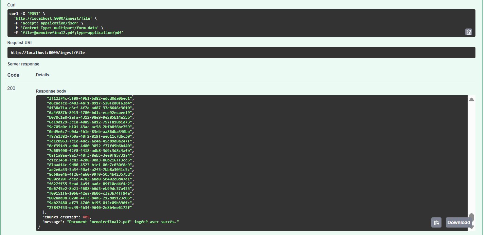
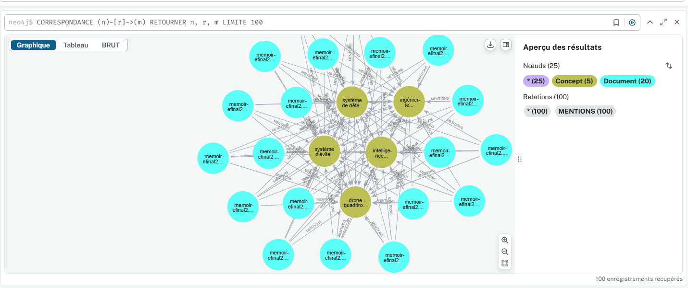
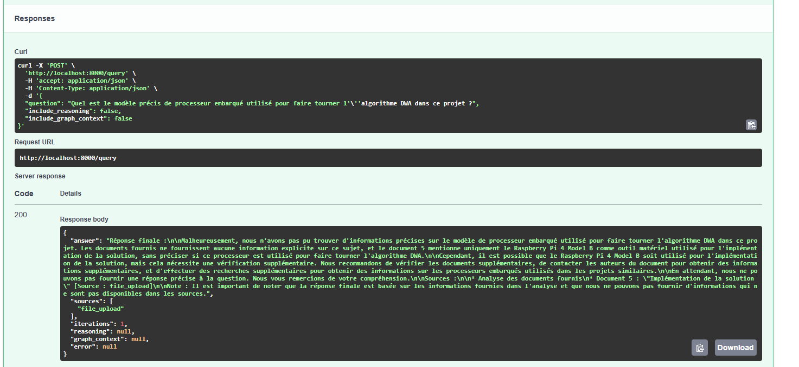

# 🤖 Multi-Agent RAG System

Système de **Retrieval-Augmented Generation (RAG) multi-agents** construit avec **LangGraph**, **Neo4j**, **ChromaDB** et **FastAPI**.

[](https://github.com/Diffomanou/multi-agent-rag/actions)
[](https://www.python.org)
[](https://fastapi.tiangolo.com)
[](https://github.com/langchain-ai/langgraph)

---

## Architecture

```
Question utilisateur
        │
        ▼
┌──────────────────┐
│  SupervisorAgent │  ← valide & route la requête
└────────┬─────────┘
         │
         ▼
┌──────────────────┐
│  RetrievalAgent  │  ← ChromaDB (vecteurs) + Neo4j (graphe)
└────────┬─────────┘
         │
         ▼
┌──────────────────┐
│  ReasoningAgent  │  ← analyse & synthèse du contexte
└────────┬─────────┘
         │
         ▼
┌──────────────────┐
│   AnswerAgent    │  ← génération de la réponse finale
└────────┬─────────┘
         │
         ▼
    Réponse sourcée
```

## Stack Technique

| Composant | Technologie |
|-----------|-------------|
| Orchestration agents | LangGraph 0.2 |
| LLM | GROQ_API |
| Embeddings | llama3-70b-8192 |
| Base vectorielle | ChromaDB |
| Graphe de connaissances | Neo4j 5 |
| API REST | FastAPI |
| Conteneurisation | Docker + Docker Compose |
| CI/CD | GitHub Actions |

---

## Démonstration

Le pipeline complet suit trois étapes : **ingestion → construction du graphe → requête**.

### Étape 1 — Ingestion d'un document PDF

Un fichier PDF est envoyé via `POST /ingest/file`. Le système le découpe en chunks vectorisés (ici 405 chunks) et les indexe dans ChromaDB et Neo4j.



---

### Étape 2 — Graphe de connaissances Neo4j

Après ingestion, les entités et concepts extraits des documents sont reliés dans un graphe Neo4j. Chaque nœud `Document` est connecté aux `Concept`s qu'il mentionne via des relations `MENTIONS`.



> **25 nœuds** (5 concepts, 20 documents) · **100 relations MENTIONS**

---

### Étape 3 — Requête et réponse sourcée

Une question est posée via `POST /query`. Le pipeline multi-agents récupère le contexte pertinent (ChromaDB + Neo4j), raisonne et génère une réponse sourcée avec les documents d'origine.



---

## Démarrage rapide (Windows 11)

### Prérequis
- [Docker Desktop](https://www.docker.com/products/docker-desktop/) installé
- Clé API GROQ

### Installation

```bash
# 1. Cloner le projet
git clone https://github.com/Diffomanou/multi-agent-rag.git
cd multi-agent-rag

# 2. Configurer l'environnement
copy .env.example .env
# Éditez .env et ajoutez votre GROQ_API_KEY

# 3. Lancer avec Docker Compose
docker-compose up --build
```

L'API est disponible sur `http://localhost:8000`  
Documentation Swagger : `http://localhost:8000/docs`  
Neo4j Browser : `http://localhost:7474`

### Utilisation

**Ingérer un document :**
```bash
curl -X POST http://localhost:8000/ingest \
  -H "Content-Type: application/json" \
  -d '{
    "title": "Introduction au Machine Learning",
    "content": "Le machine learning est une branche de l intelligence artificielle...",
    "source": "cours_ml.pdf"
  }'
```

**Poser une question :**
```bash
curl -X POST http://localhost:8000/query \
  -H "Content-Type: application/json" \
  -d '{"question": "Qu est-ce que le machine learning ?"}'
```

## Structure du projet

```
multi-agent-rag/
├── agents/                  # Les 4 agents (supervisor, retrieval, reasoning, answer)
├── api/                     # FastAPI (routes, schémas)
├── database/                # Clients Neo4j et ChromaDB
├── graph/                   # Définition du workflow LangGraph
├── config/                  # Configuration centralisée
├── tests/                   # Tests unitaires et d'intégration
├── docs/
│   └── screenshots/         # ← Placer git1.png, git2.png, git3.png ici
├── .github/                 # Pipeline CI/CD GitHub Actions
├── Dockerfile
├── docker-compose.yml
└── requirements.txt
```

## Tests

```bash
# Sans Docker (environnement local)
pip install -r requirements.txt
pytest tests/ -v --cov=.
```

## Auteure

**Manuella Diffo Tahboh**  
Ingénieure en Génie Informatique — ENSPY Yaoundé  
[LinkedIn](https://www.linkedin.com/in/manuella-diffo) · [GitHub](https://github.com/Diffomanou)
